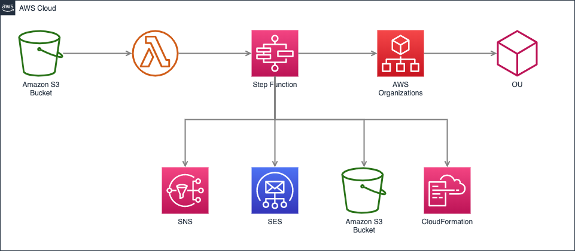
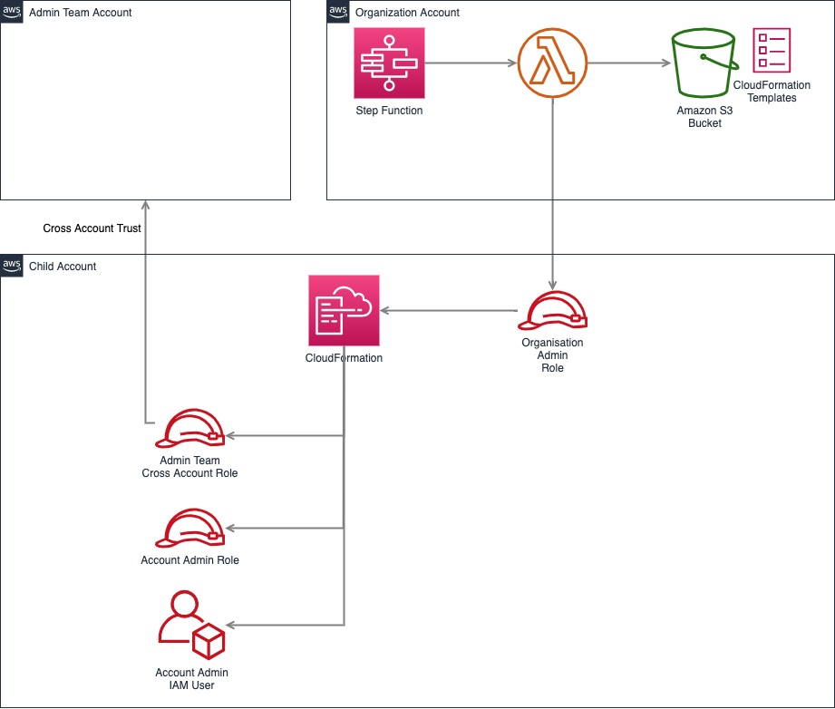

# AWS Account Vending Machine

## Features
- Built a serverless and dynamic Account Vending Machine to create AWS accounts and Organizational Units. 
- Implemented Lambda and Step functions to interact with AWS Organizations and CloudFormation templates. 
- Employed Amazon S3, SNS, and SES to trigger notifications and store information about created accounts.

## System Flow

### How an account is created?

1. Creates a new Organization Unit, if it doesn't already exists, with the specified name.
2. Creates a new AWS account with the specified name.
3. Moves the new AWS account in under the OU.
4. Assumes the Organization Admin Role in the new account and deploys specified CloudFormation templates. In default setup and events that would be:
   1. Create a cross account admin role with trust to the specified admin account number and with the specified name.
   2. Create an IAM User with specified username and password, this user is considered the account owner.
5. Notifies the Organization admins and the account owner that the create process is completed. 
  
